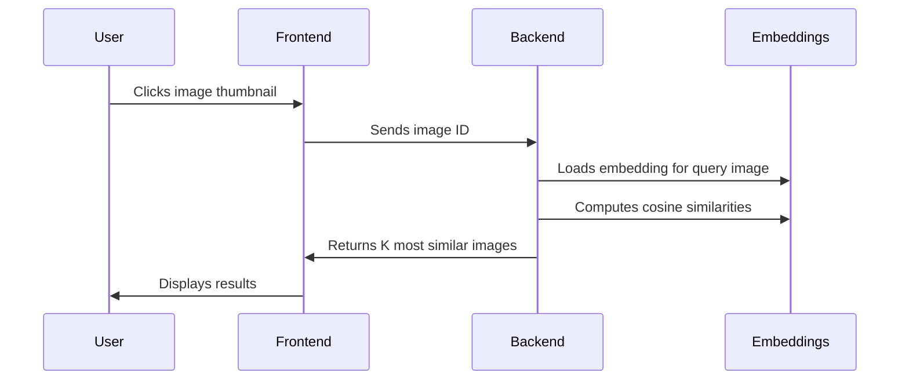

# 🖼️ Image Similarity Search – Minimal MVP Prototype

<p align="center">
  <a href="https://github.com/yourusername/reverse-image-search">
    
  </a>
  <a href="https://palletsprojects.com/p/flask/">
    
  </a>
  <a href="https://github.com/yourusername/reverse-image-search/blob/main/LICENSE">
    
  </a>
  
  
  
</p>

---

## 🚀 Introduction

This repository hosts a minimal, fully-offline prototype of an **Image Similarity Search** system. The user can click/tap on an image from a local gallery, and the backend returns a set of visually similar images. This project demonstrates the basic workflow for image similarity search: images are indexed via deep-learning-based embeddings, and queries are answered using nearest-neighbor search on these vectors.

> **Note:** This prototype is designed for maximum simplicity and local/offline use. It’s purpose-built for demonstration, experimentation, and quick prototyping.

---

## ✨ Features

- 🖼️ **Local Image Gallery:** All search and retrieval is performed on your own image collection.
- 🧠 **MobileNetV2-based Embeddings:** Efficient image representations generated using pre-trained MobileNetV2 (Tensorflow/Keras).
- 🔍 **Cosine Similarity Nearest Neighbor Search:** Finds images close in the embedding space using fast cosine similarity.
- ⚡ **Simple Flask Web UI:** Clean web interface for browsing and searching images.
- 🔒 **Works 100% Offline:** No external API calls, all computation is done locally.

---

## 📁 Project Structure

```text
reverse-image-search/
├── static/
│   └── images/           # Source image gallery (add your images here)
├── templates/
│   └── index.html        # Main web UI
├── embeddings/
│   └── embeddings.npy    # Saved image embeddings (generated by utility script)
│   └── filenames.pkl     # List of image filenames
├── prepare_embeddings.py # Utility: generates MobileNetV2 embeddings for gallery images
├── app.py                # Flask backend serving the UI and API
├── requirements.txt      # Python dependencies
└── README.md             # Project documentation
```

---

## 🛠️ Technical Overview

### 🧩 Embeddings Generation

- When you run `prepare_embeddings.py`, it loads each image in `static/images/`, resizes it to MobileNetV2’s input size, and passes it through a pre-trained MobileNetV2 (without the classification head).
- The resulting embedding vector for each image is saved in `embeddings/embeddings.npy`.
- The corresponding image filenames are saved in `embeddings/filenames.pkl`.

### 📐 Similarity Search

- When a user clicks/selects an image, its embedding is retrieved.
- The system calculates cosine similarity between this embedding and all other embeddings in the gallery.
- The K most similar images (by cosine similarity) are returned.

### 🪄 Flask Backend

- **API Endpoint:** Handles requests from the frontend for similar images.
- **Serves gallery:** Serves static image files and the search UI.
- **Similarity:** On request, loads saved embeddings and performs similarity search.

### 🤖 Frontend (HTML/JS)

- Gallery page loads thumbnails of available images.
- When a user clicks an image, sends a request to the Flask API with the image ID.
- Displays the clicked image and a grid/list of visually similar images.

---

## 📦 Installation & Setup

### 1. Clone the Repo

```bash
git clone https://github.com/yourusername/reverse-image-search.git
cd reverse-image-search
```

### 2. Create a Virtual Environment

```bash
python3 -m venv venv
source venv/bin/activate
```

### 3. Install Dependencies

```bash
pip install -r requirements.txt
```

### 4. Add Gallery Images

- Put your `.jpg`/`.png` images in `static/images/`.

### 5. Generate Image Embeddings

```bash
python prepare_embeddings.py
```

- This will create/update `embeddings/embeddings.npy` and `embeddings/filenames.pkl`.

### 6. Start the Flask Server

```bash
python app.py
```

- Visit [http://localhost:5000](http://localhost:5000) in your browser.

---

## 🏄‍♂️ Usage Guide

1. Open the web UI in your browser.
2. Browse the gallery of images.
3. **Click** any image you wish to use as your query.
4. The UI will display a set of visually similar images from your local collection.



---

## 🛤️ Future Improvements

- 🌐 Support remote galleries/cloud storage.
- ✂️ Add cropping/region-based queries.
- ⚡ GPU acceleration for embedding generation.
- 🏋️ More advanced model options (e.g., CLIP, ResNet).
- 👥 Add batch search and filtering options.
- 🐳 Dockerization for easy deployment.

---

## 📄 License

This project is provided under the MIT License.

---

## 🤝 Contributing

Contributions, feature requests, and bug reports are welcome! Please open an issue or submit a pull request. All contributors must agree to the MIT License terms.
